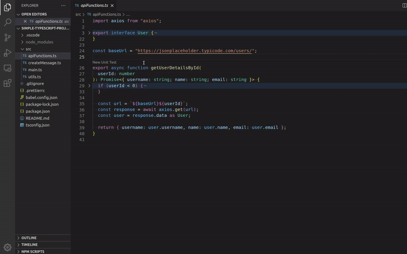

# Repository for Testent VSCode extension

This repository is for issues in the Testent VSCode extension. Thank you for sending issues!

 

You can download this extension to your VSCode from the [Microsoft Marketplace](https://marketplace.visualstudio.com/items?itemName=Testent.testent-vscode-extension)

 

## Testent
**Testent** is an IDE extension semi-automatically creating unit tests for Typescript code. 

**Testent** adds "smart console.logs" to a local copy of your code before running it and then records what happens at runtime. The recordings are then turned into function mocks and test code.

**The plugin does not send your data anywhere** and there is no machine learning involved.

It creates the unit tests for [Jest](https://jestjs.io/)-framework but later on other testing frameworks can be used too.

Currently only Typescript is supported. Javascript will be supported later on. You need to have the Typescript types installed/available for the packages used in code at the moment for the test generation to work.

## Note
This extension is in it's early stage so please expect some bumps and bugs on your way using it.ges.

  

# VSCode extension at work
## Automatically writing unit tests

Testent automatically writes unit tests for functions from inputs you give. The function you want to test is executed in your environment with the given inputs. This means that the environment used by the function needs to be reachable.

  <picture>
      <source srcset="./images/docs/testent-automated-unit-test-writing-preview.webp" type="image/webp">
      <source srcset="./images/docs/testent-automated-unit-test-writing-preview.gif" type="image/gif">
      
  </picture>

- The `createInternalFunctionExpects_X` option let's you choose if the internal logics of the function you test should be tested. If enabled `expect`-statements will be created for internal logics

  

## Running a function with inputs

Testent can also execute your function with the given inputs for you to test what the function returns or throws.

  

